# Karate Club Management System 🥋
**A robust 3-Tier Desktop Application for Martial Arts Schools**

This project is a sophisticated management solution designed to handle members, instructors, belt ranks, and financial subscriptions. Built with **C#** and **SQL Server**, it demonstrates high-level software engineering patterns including **Abstraction**, **Inheritance**, and **Bitwise Security Systems**.

## 🏗️ Architectural Overview
The system is divided into three logical layers:
1.  **Presentation Layer (PL):** WinForms-based UI providing a seamless user experience.
2.  **Business Logic Layer (BL):** Implements complex rules for membership validity, belt progression, and financial tracking.
3.  **Data Access Layer (DAL):** High-performance data operations using **ADO.NET** and Stored Procedures.

---

## 🔐 Advanced Security: Bitwise Permission System
One of the core features of this project is the **Fine-Grained Access Control**. Unlike simple "Role" systems, this project uses **Bitwise Logic** to manage permissions efficiently at the database and application levels.

### 🛠️ How it works in the code:
Permissions are stored as a single integer, where each bit represents a specific access right:
- `pInstructors = 1` (0001)
- `pUsers = 2` (0010)
- `pMembers = 4` (0100)
- `pPayment = 8` (1000)

> **Implementation Insight:** The system uses the `&` (Bitwise AND) operator to check access in real-time:
> `if ((this.Permission & (int)Permissinos) == (int)Permissinos)`

---

## 📸 App Preview

### 🔐 Authentication & Security
| Login Screen | Advanced Permission Management |
|:---:|:---:|
| 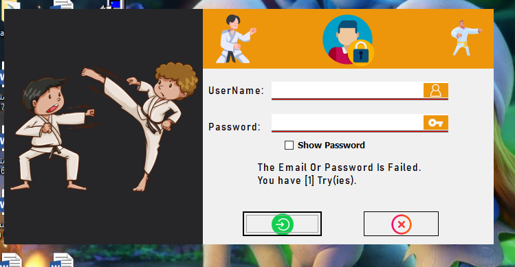 | 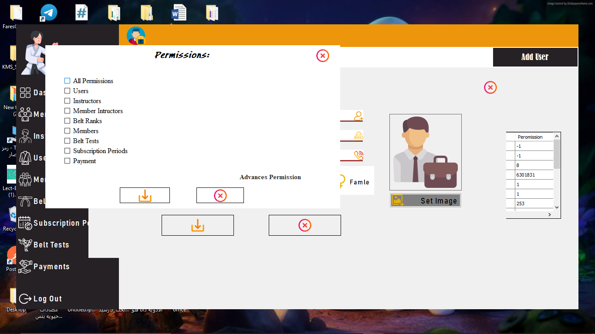 |

### 🥋 Core Club Management
| Members Directory | Instructors | Belt Ranks |
|:---:|:---:|:---:|
|  | 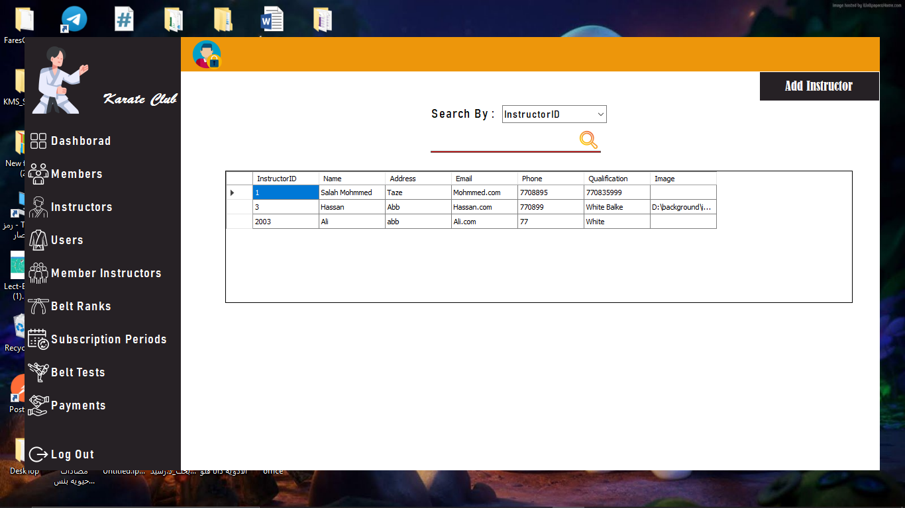 | 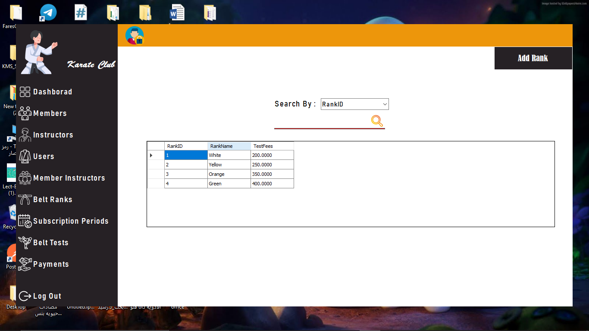 |

### 🔄 Operations & Actions
| Member Registration | Add/Edit Instructor | User Management |
|:---:|:---:|:---:|
|  | 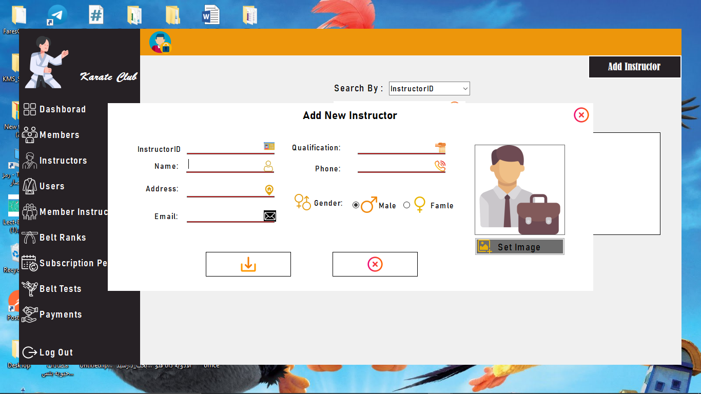 | 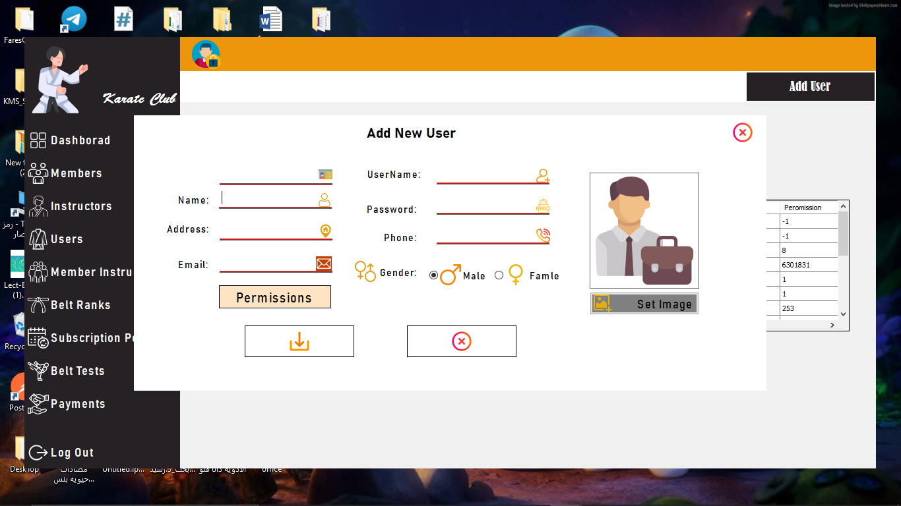 |

### 💰 Financials & Subscriptions
| Payment History | Subscription Periods | New Payment |
|:---:|:---:|:---:|
| 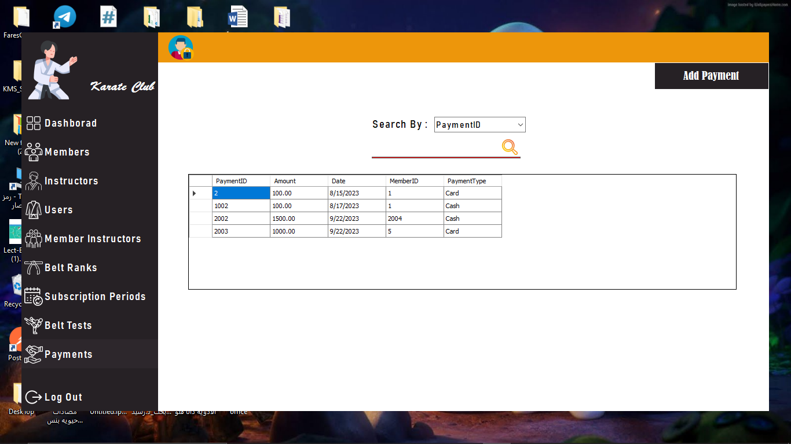 | 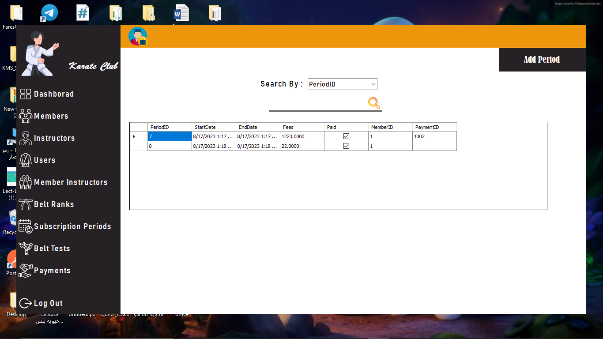 | 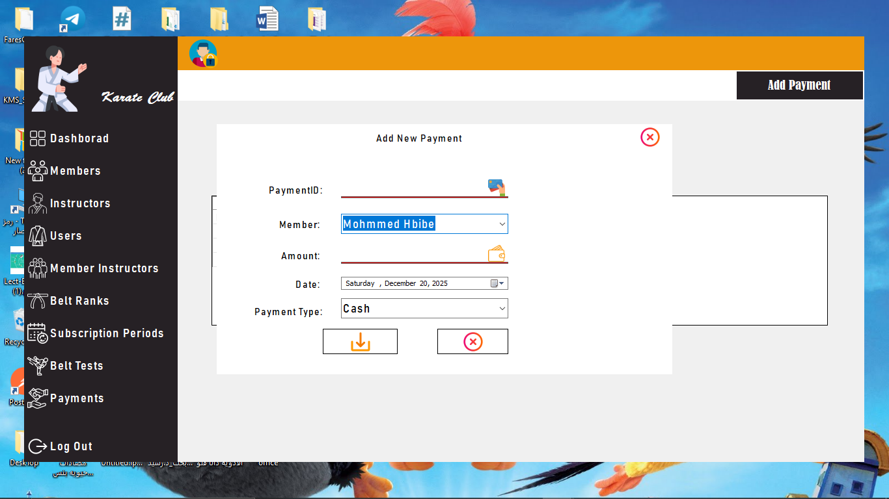 |

### 🏆 Belt Progress & Training
| Belt Testing Log | Instructor Assignments | Add Rank |
|:---:|:---:|:---:|
| 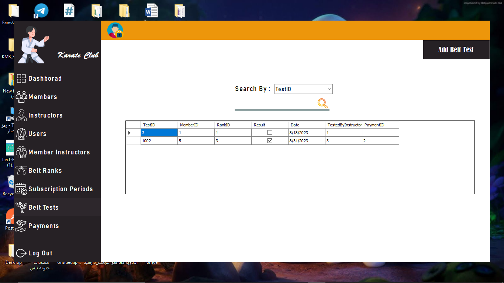 | 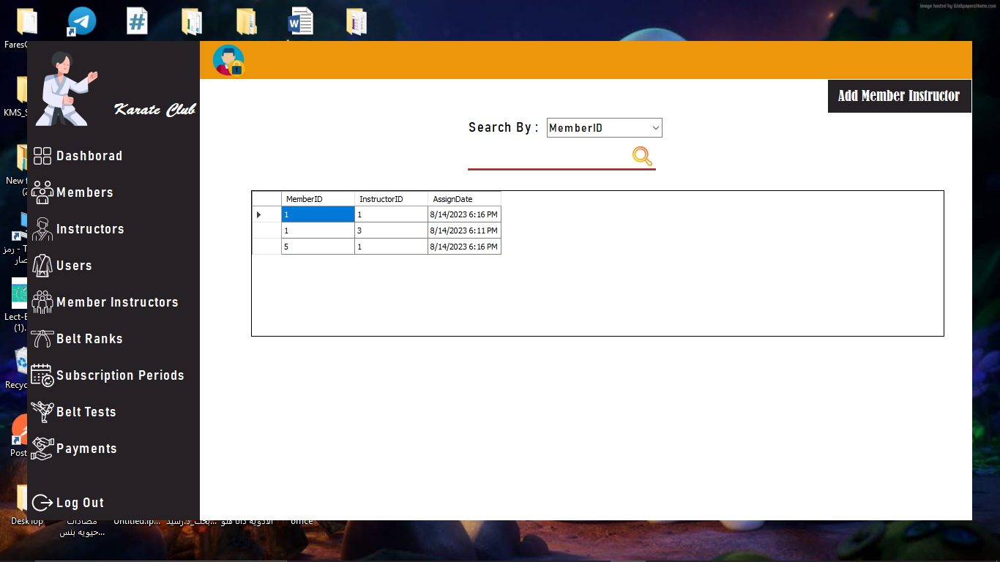 | 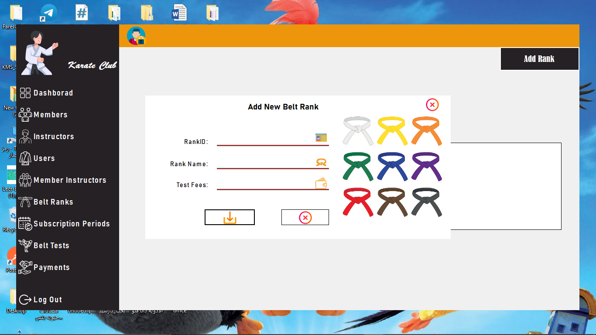 |

---

## 🧬 Key Technical Features
* **Deep Inheritance:** Using `clsPerson` as a base for `clsMember`, `clsInstructor`, and `clsUser` to minimize code redundancy.
* **Mode-Based Logic:** Entities automatically track their state (`AddMode` / `UpdateMode`) for smart database synchronization.
* **Junction Entity Management:** Specialized logic to handle the Many-to-Many relationship between Members and Instructors via `clsMemberInstructor`.
* **Financial Integrity:** Integrated `clsPayment` and `clsPeriod` to ensure membership sessions are only active upon payment.

## 🛠️ Tech Stack
* **Language:** C# (.NET Framework)
* **Database:** MS SQL Server
* **Data Access:** ADO.NET (Optimized Stored Procedures)
* **Architecture:** 3-Tier Layered Architecture

---

## 📂 Project Structure
* 📁 **KarateClub_PL**: Windows Forms and UI components.
* 📁 **KarateClub_BL**: Business Logic Layer (Entities & Rules).
* 📁 **KarateClub_DAL**: Data Access Layer (ADO.NET & SQL Mapping).
* 📁 **Database**: 
    * `KarateClubDB.sql`: Full script to generate tables, constraints, and relationships.
    * `StoredProcedures.sql`: Optimized procedures for all CRUD operations.
* 📁 **screenshots**: High-quality images of the application.

---
## 🚀 How to Run
1.  Clone the repository.
2.  Import `KarateClub_DB.sql` into your SQL Server instance.
3.  Update the connection string in the `KarateClub_DAL` layer.
4.  Build and Run using Visual Studio.

---
**Developed by [Your Name]** *Focused on Clean Code, OOP, and Scalable Design.*
